**Rapport sur l'application décentralisée d'enchères hollandaises**

---

**Introduction**

Ce rapport fournit des instructions détaillées sur l'utilisation de l'application décentralisée (dApp) développée pour les enchères hollandaises. Il couvre les étapes nécessaires pour l'authentification des utilisateurs via MetaMask, la participation aux enchères, la soumission des offres, la gestion des enchères en cours, ainsi que la consultation des résultats finaux des enchères.

**1. Authentification et Profil**

L'authentification des utilisateurs se fait via MetaMask en cliquant sur le bouton "Connect MetaMask" et en entrant le mot de passe associé au compt MetaMask.
Les données du portefeuille, notamment la clé publique et le solde en ETH.  

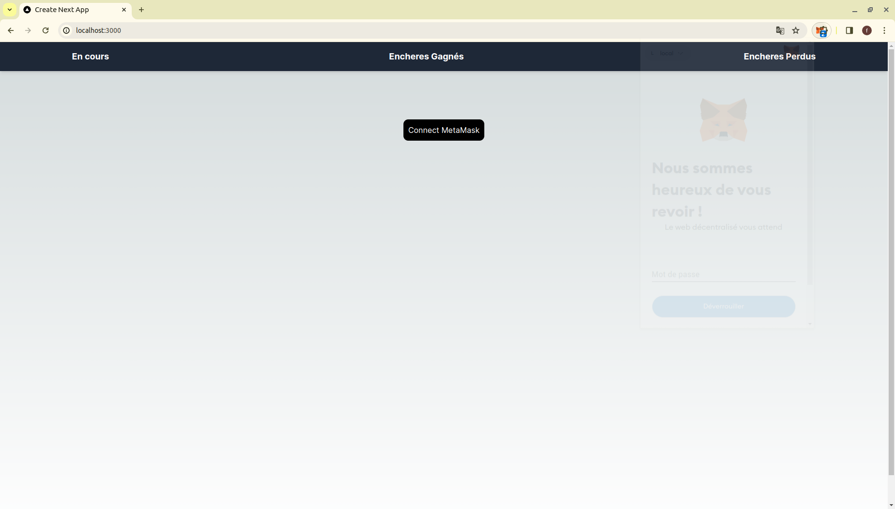
  
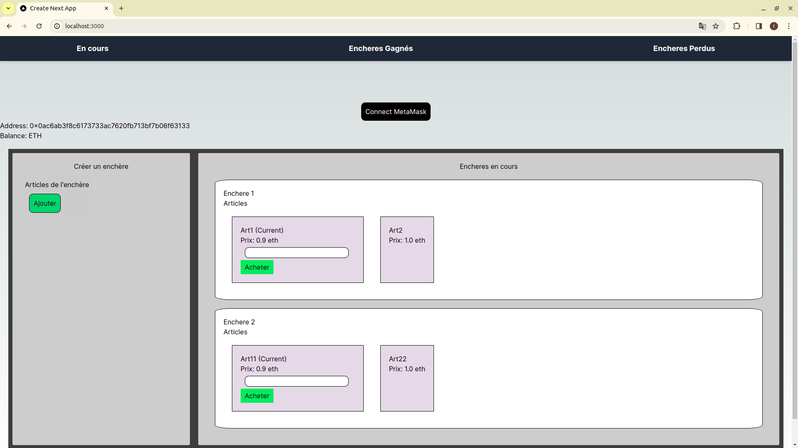

 
**2. Gestion des Enchères**

La fonctionnalité principale de l'application est la gestion des enchères, qui comprend les éléments suivants :

- **Liste des Enchères Disponibles :** Les utilisateurs peuvent visualiser toutes les enchères disponibles sur la plateforme.

  

**Création d'une Enchère :**  Pour ajouter plusieurs articles à une enchère, cliquez sur "Ajouter". Une fois que la liste des articles est terminée, cliquez sur "Créer" pour finaliser l'enchère. Vous devrez également insérer le mot de passe de MetaMask pour finaliser la création. Si vous souhaitez annuler, cliquez sur "Annuler".

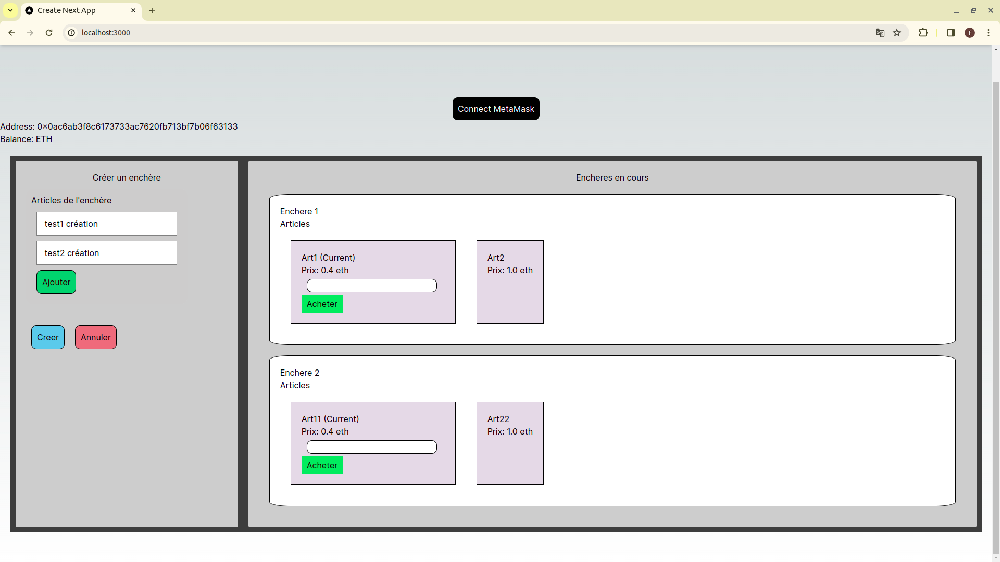

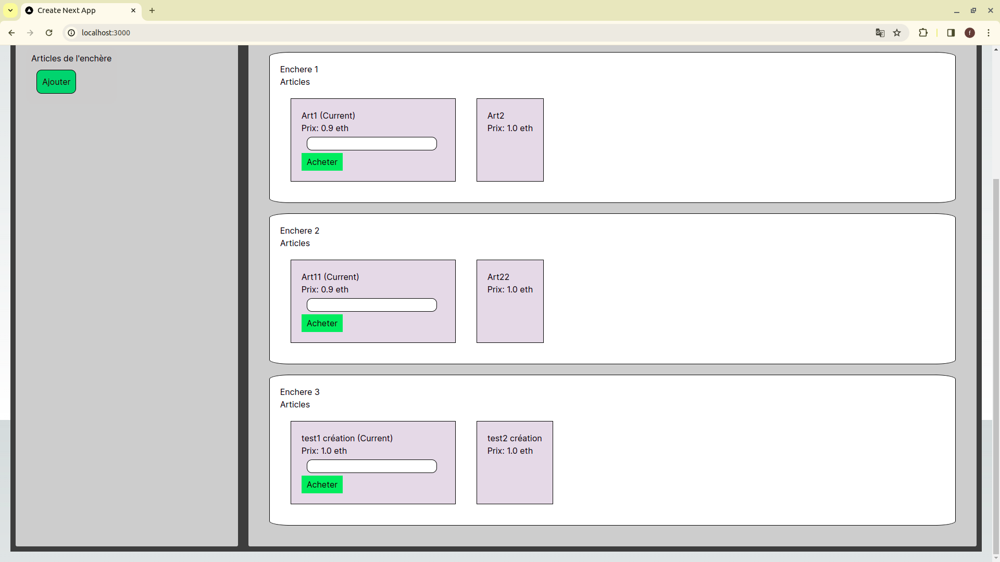

- **Enchérir:** Les utilisateurs peuvent participer à une ou plusieurs enchères en cours en suivant ces étapes simples :
   Indiquez le prix que vous êtes prêt à payer et cliquez sur "Acheter" pour soumettre votre offre.

   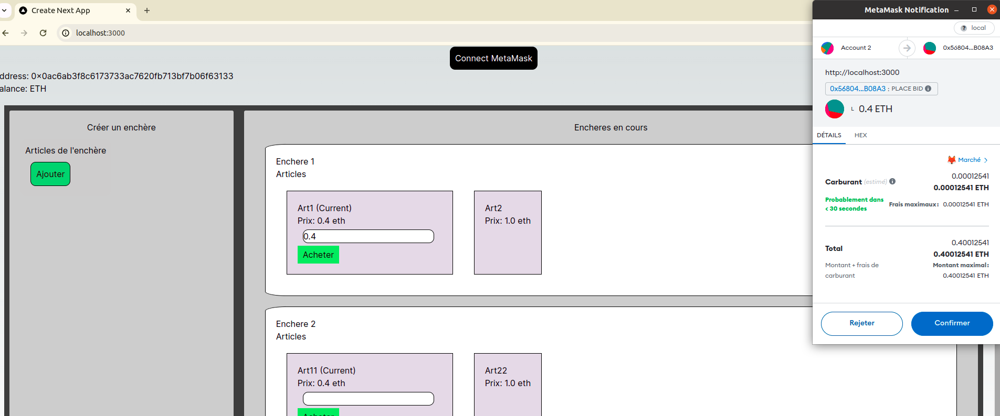

- Une fois que vous avez acheté un article, accédez à l'onglet "Enchères Gagnées" dans la barre de navigation.
- Vous y trouverez l'article que vous avez remporté répertorié dans la liste des enchères gagnées. 
- Les versements seront effectués selon les modalités convenues lors de la participation à l'enchère

 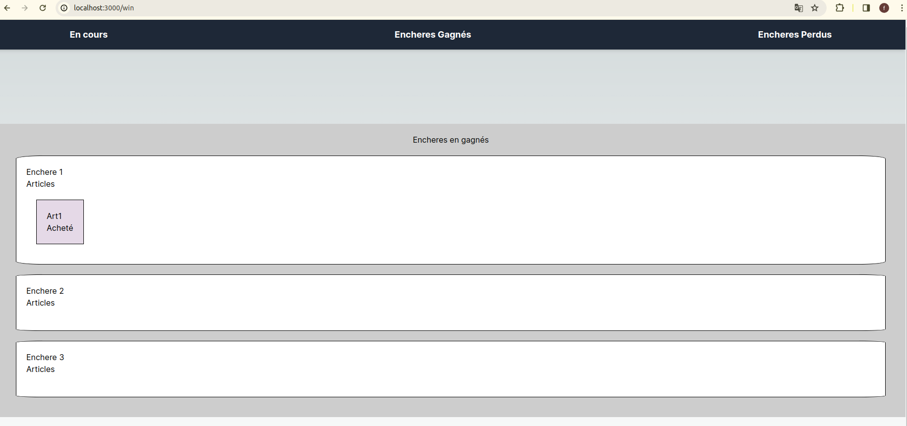

- Si vous changez de compte, vous trouverez cette enchère répertoriée dans la section "Enchères Perdues" 

 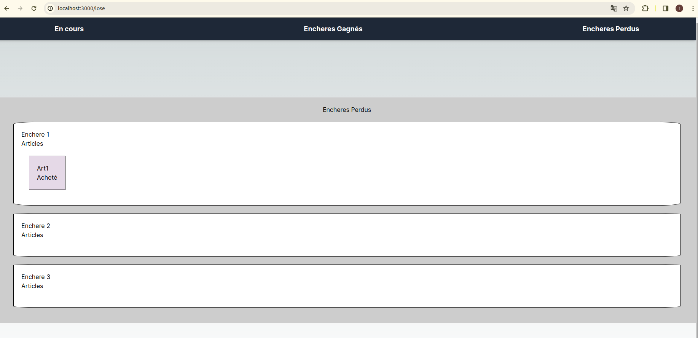

- Une fois que vous avez acheté un article, cet article ne sera plus disponible dans la liste des enchères en cours.

 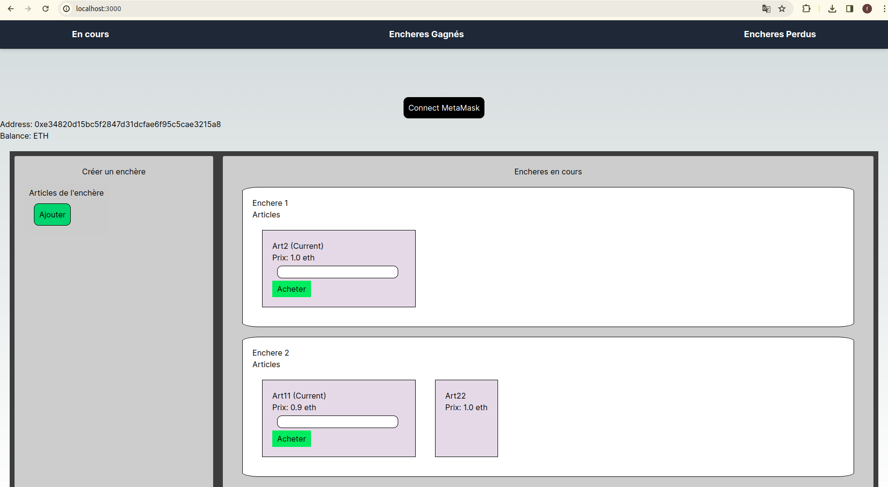

- Vous pouvez enchérir directement sur une autre  enchère, mais dans la même enchère, il est nécessaire d'attendre que l'article en cours soit acheté ou que l'enchère soit close avant de pouvoir enchérir sur un  nouveau.

 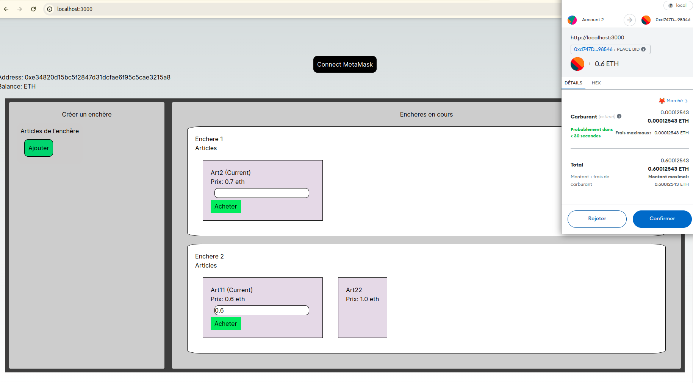

- Vous y trouverez l'article que vous avez remporté répertorié dans la liste des enchères gagnées. 

 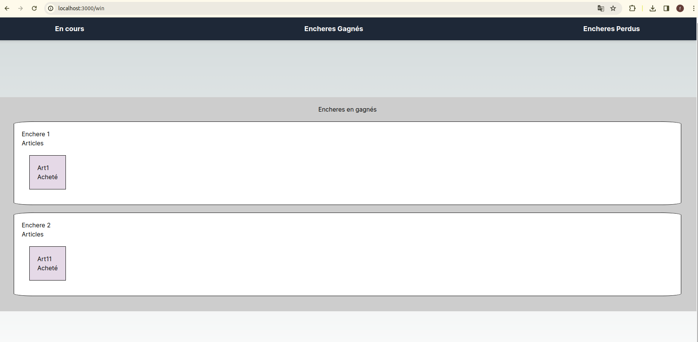

- Si vous changez de compte, vous trouverez cette enchère répertoriée dans la section "Enchères Perdues"

 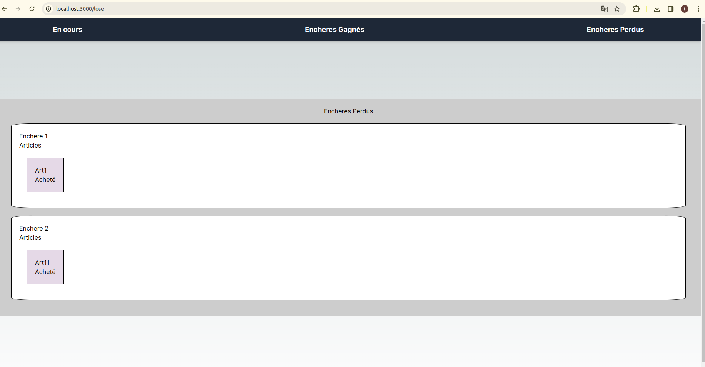
